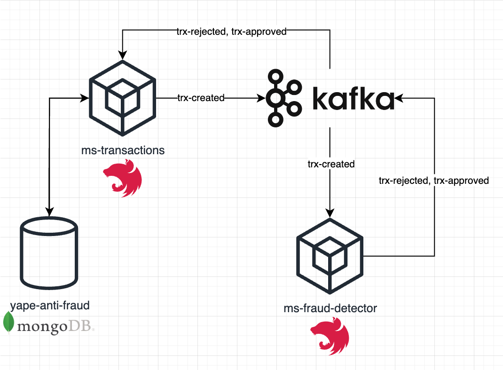

# Installation Guide

## Candidate: Alexander Esteban Joffre Aguirre

## Architecture


This solution is composed by 2 micro services. They comunicate between each others using Kafka's topics. For this, both services auto connect when they start and read their respective topics.

The flow to create and validate if a transaction is a possible fraud or not is:

1. Send POST request to ***/transactions/create*** in ms-transactions. It creates the transaction into db and publish a message into **trx-created** Kafka's topic

2. Then, when the ***ms-fraud-detector*** notices that a new message is published into this topic, it proceeds to validate the transaction amount.
	1. If it's higher than 1000, then publish a message into **trx-rejected** Kafka's topic.
	2. If it's less than or equals to 1000, then publish a message into **trx-approved** Kafka's topic.

3. So, when ***ms-transactions*** notices that a new message is published into any of them, it proceeds to update the transaction record depending on if it's approved or rejected. Finally, it sets the ***isClosed*** with **true** to indicate that the record couldn't be updated again.

## Technologies used
- NestJS Framework
- Kafka
- MongoDB

## 1. Run Dependencies with docker
Execute the following command:
```bash
docker-compose up
```

## 2. Set up kafka topics

Run the following commands to create the 3 required kafka services to ensure the correct application behavior:

- `trx-created`
```bash
docker exec -it kafka /opt/kafka/bin/kafka-topics.sh --create --zookeeper zookeeper:2181 --replication-factor 1 --partitions 1 --topic trx-created
```

- `trx-approved`
```bash
docker exec -it kafka /opt/kafka/bin/kafka-topics.sh --create --zookeeper zookeeper:2181 --replication-factor 1 --partitions 1 --topic trx-approved
```

- `trx-rejected`
```bash
docker exec -it kafka /opt/kafka/bin/kafka-topics.sh --create --zookeeper zookeeper:2181 --replication-factor 1 --partitions 1 --topic trx-rejected
```

## 3. Prepare transactions microservice
### 3.1 Move into the micro service for transactions folder
```bash
cd ms-transactions
```
### 3.2 Install dependencies
```bash
npm i
```
### 3.3 Set up initial data into Mongo DB
```bash
npm run migrations
```
### 3.4 Configure environment variables
create a file in this directory called .env and copy the following code into this and save it:
```
APP_PORT=3000
APP_ID=ms-transactions

MONGODB_CONNECTION_URL=mongodb://localhost:27017/yape-anti-fraud

KAFKA_BROKER=localhost:9092
KAFKA_CLIENT_ID=yape
KAFKA_GROUP_ID=yape
KAFKA_SUBSCRIBE_TOPICS=trx-rejected,trx-approved
```
### 3.4 Initiate service
```bash
npm run start
```
**NOTE**: to see the full documentation, once it was initiated, you can visite the *[ms-transactions API Docs](http://localhost:3000/docs)*

## 4. Prepare fraud detector microservice
### 4.1 Move into the fraud-detector for transactions folder
```bash
cd ..
cd ms-fraud-detector
```
### 4.2 Install dependencies
```bash
npm i
```
### 4.3 Configure environment variables
create a file in this directory called .env and copy the following code into this and save it:
```
APP_PORT=3001
APP_ID=ms-fraud-detector

KAFKA_BROKER=localhost:9092
KAFKA_CLIENT_ID=yape
KAFKA_GROUP_ID=yape
KAFKA_SUBSCRIBE_TOPICS=trx-created
```
### 4.4 Initiate service
```bash
npm run start
```